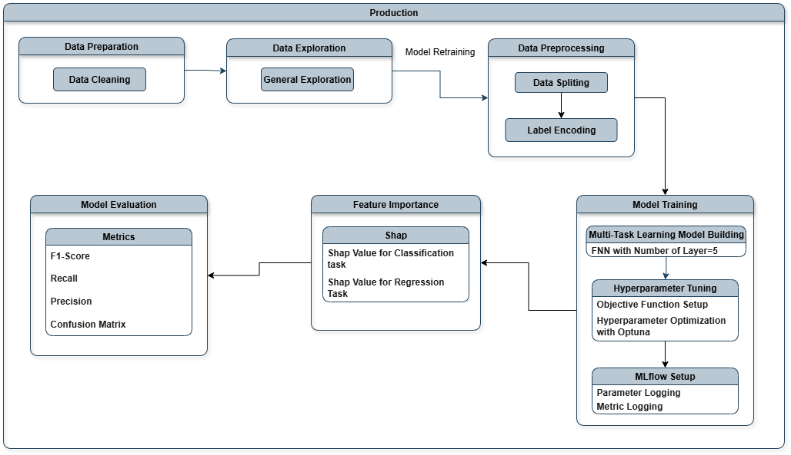

# **DL_MultiTaskLearning_DonationMaximization**
### This project construct an business solution─an automated multi-task learning model─for the NPO, enabling the creation of outreach list and development of the persona for campaign design.
### Expected Outcome
- #### Efficiency of selecting donors enhance 75%

---

# 1. [Experimentation](Code/experimentation.ipynb)
### The experiment exhibit the business solution for targeting audiences, including data preparation, model building, hyperparameter tuning, model evaluation, and feature importance analysis.

### 1.1. Data Preparation
#### Pandas and Target Encoder are utilized to prepare data.

### 1.2. 