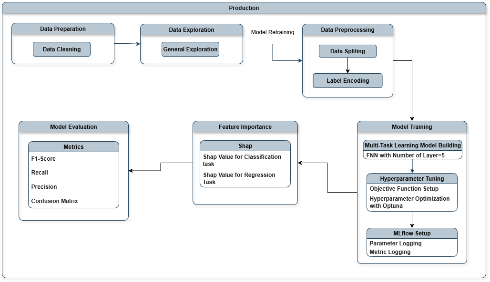

# **Audience Targeting employing Multi-Task Learning**
### This project construct an business solution─an automated multi-task learning model─for the NPO, enabling the creation of outreach list and development of the persona for campaign design.
### Expected Outcome
- #### Efficiency of selecting donors enhance 75%

---

# 1. [Experimentation](src/experimentation.ipynb)
### The experiment exhibit the business solution for targeting audiences, including data preparation, model building, hyperparameter tuning, model evaluation, and feature importance analysis.

### 1.1. Data Preparation
#### Pandas and Target Encoder are utilized to prepare data.

### 1.2. Data Exploration

### 1.3. Model Building
#### Multi-task learning architectures with five and six layers are developed utilizing Tensorflow and compared on the basis of recall. The model with five layers, including Dense, Batch Normalization, and Dropout layers, is selected given higher recall. Hyperparameters are tuned leveraging Optuna.

### 1.4. Model Evaluation
#### Confusion matrix are deployed to analyze indicators of model performance, namely F1-score, recall and precision.

### 1.5. Feature Importance Analysis
#### Feature importance are quantified applying SHAP.

---

# 2. Production

### 2.1. [Data Preparation](src/data_preparation.py)

### 2.2. [MLflow Setup](src/mlflow_setup.py)

### 2.3. [Model Building](src/model_building.py)

### 2.4. [Hyperparameter Optimization](src/hyperparameter_optimization.py)

### 2.5. [Model Prediction](src/model_prediction.py)

### 2.6. [Main_PiPeline](src/main.py)

---

### **Contact**
#### Feel free to contact for further information.
#### **LinkedIn:** [LinkedIn Link](https://www.linkedin.com/in/chih-peng-javen-li-7b35561b9/)